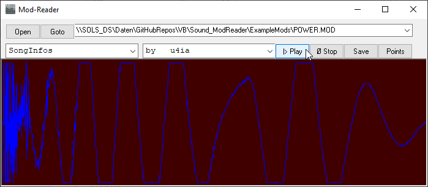

# Sound_ModReader  
## Reader for tracker mod files  
  
* reads *.mod-files (AMIGA-Protracker and others)  
* presents song informations and  
* pattern informations   
* view samples graphically, and  
* plays and extracts the samples  
* one bsp-mod is included  
  

